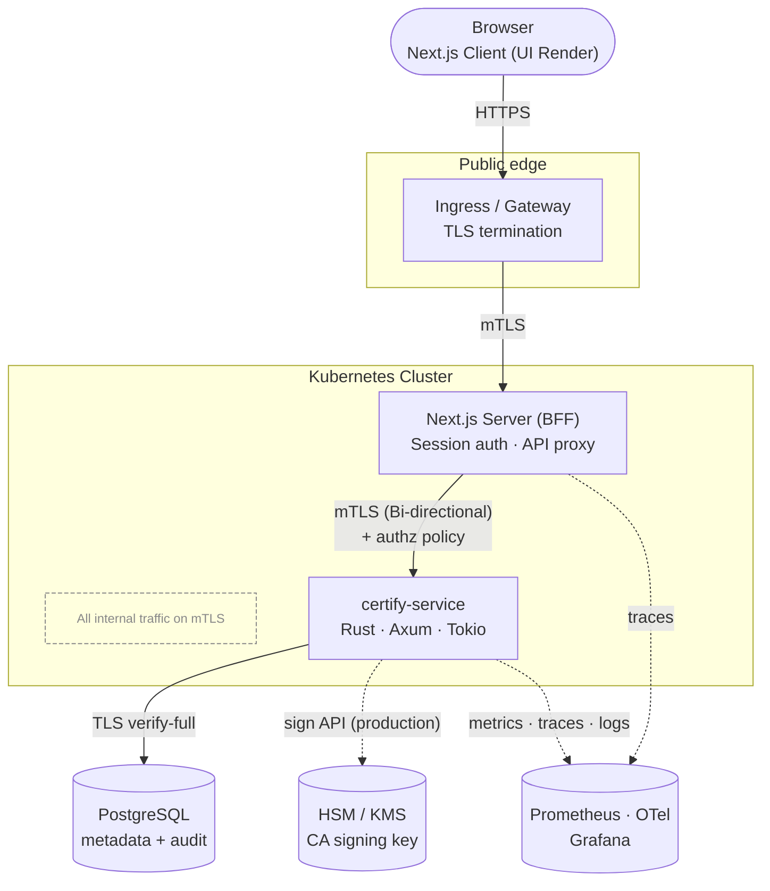
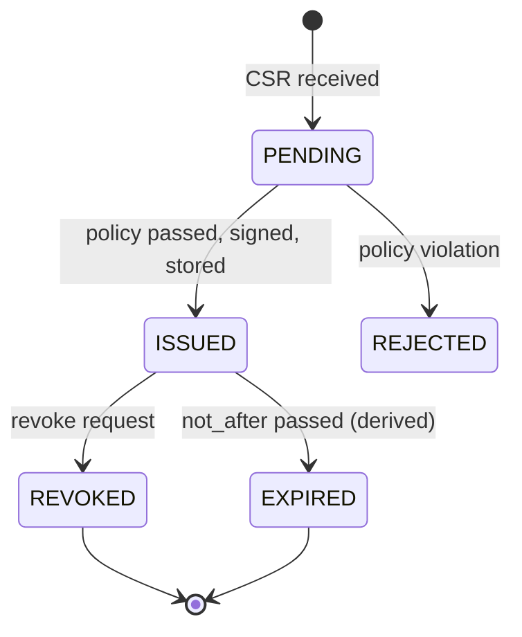
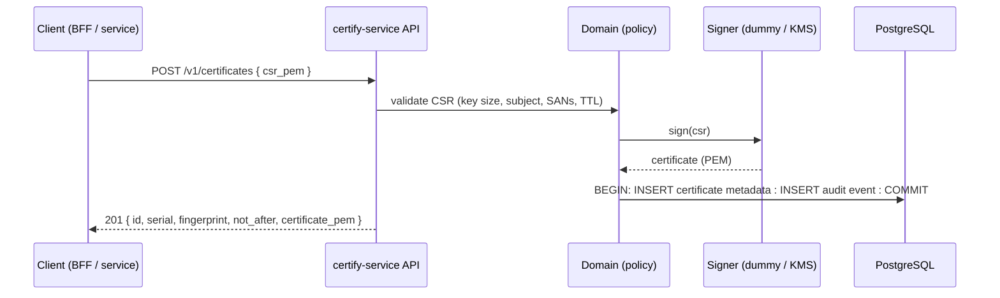
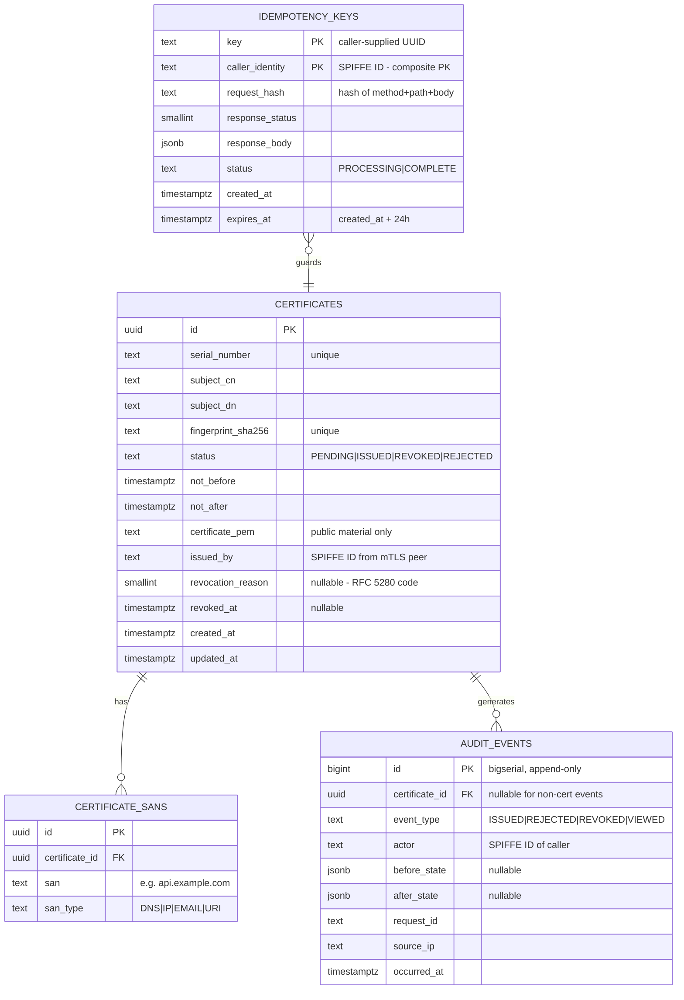
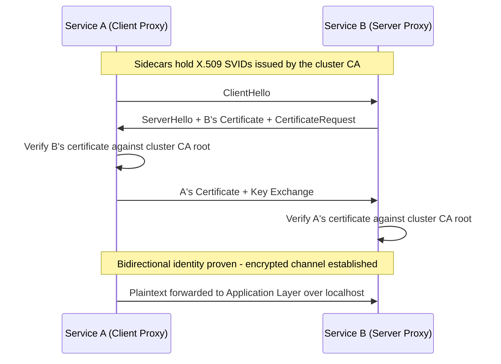
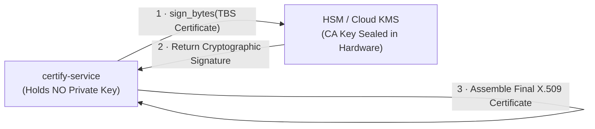
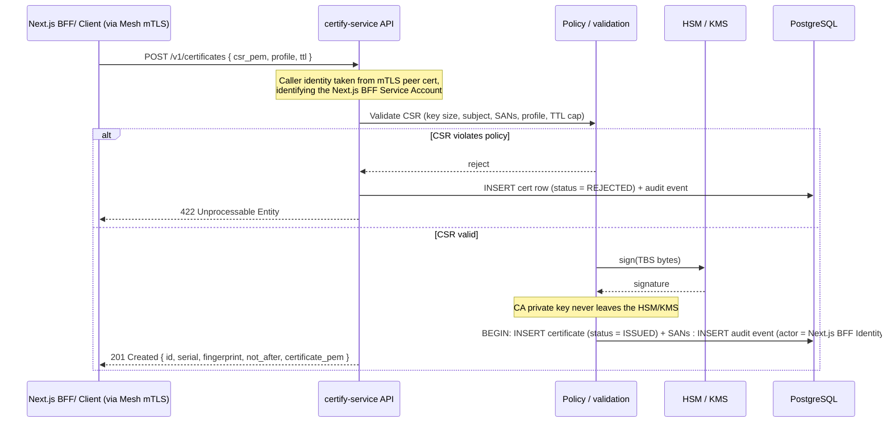
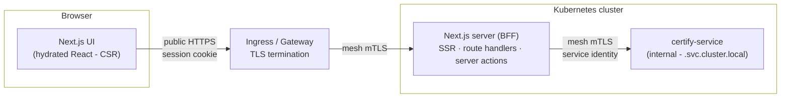

# Certify - Certificate Issuance & Inventory Microservice

**Certify** is a Rust microservice that issues (Dummy) X.509 certificates, keeps an inventory of their metadata in PostgreSQL, and exposes a secure API consumed by a Next.js frontend. Running on Kubernetes with mTLS on every internal service-to-service communication, audit logging, and full observability.

The system must:

* Issue (Dummy) X.509 certificates
* Store certificate metadata in PostgreSQL
* Support certificate lookup and inventory management
* Run on Kubernetes
* Enforce mTLS for service-to-service communication
* Expose secure APIs consumed by a Next.js frontend
* Provide audit logging, metrics, tracing, and operational visibility

# 1. High-Level Architecture

The system consists of the following components:



## 1.1 Rust microservice design

### Async runtime & library choices

| Layer | Library | Why this one, and what I considered instead |
|---|---|---|
| Async runtime | **tokio** | Production-proven, multi-threaded runtime. Its work-stealing scheduler is optimized for highly concurrent, I/O-bound API traffic. Offering unmatched ecosystem maturity and native integration with our web and database framework. |
| Web Framework | **axum** + **tower** | Built directly on `hyper` and `tower` infrastructure. This allows modular middleware such as authentication, CORS policies, timeouts, and rate limiting to compose natively as `tower::Layer` instances. Struct-driven typed extractors enforce request validation directly at the application routing boundary. |
| DB access | **sqlx** | An async-native SQL client that uses compile-time macros `query!` to validate raw SQL queries against our database schema. This guarantees that schema drift or query syntax errors trigger a build failure rather than a runtime failure in production |
| X.509 Operations / CSR | **rcgen** + **x509-parser** | Pure-Rust generation and zero-copy parsing of crypto primitives. Inbound CSR metadata is extracted via x509-parser and passed to an rcgen certificate builder. A custom trait abstracts the signing engine, seamlessly swapping a local software signer `rcgen::SigningKey` during testing for a secure HSM/KMS client in production. |
| Logging/tracing | **tracing**, **tracing-subscriber**, **opentelemetry** | Leverages the `tracing` ecosystem for context-aware, span-based structured logging across asynchronous Tokio tasks. Integrating `opentelemetry` allows these identical spans to be exported seamlessly as distributed traces to Grafana. |
| Metrics | **metrics** + Prometheus exporter | The metrics crate facilitates application instrumentation by providing a standardized facade for tracking execution counts and performance latencies. It enables developers to automatically aggregate metrics from application logic and upstream dependencies, exposing them via an internal endpoint for native Prometheus scraping within the cluster. |
| Config | **figment** or **config** | Enables a strongly-typed, layered configuration hierarchy that matches Kubernetes infrastructure. It merges base code defaults, environment configurations from ConfigMaps, and sensitive injection from Secrets into a unified, validated schema at startup |
| Errors | **thiserror** (library code) + a single `ApiError` type | Uses thiserror to derive strongly-typed, context-preserving internal domain errors. These map cleanly at the Axum routing boundary to a single ApiError implementing IntoResponse, enforcing an `unwrap()` free execution path that outputs standardized RFC 7807 problem details to the client. |

### Module layout (API boundaries)

The crate is structured as a **library with a thin binary entry point**. All application logic lives in `lib.rs` and its modules; `main.rs` is a 5-line shell. This means integration tests in `tests/` can import the crate like any external consumer, no test-only hacks needed.

```text
src/
├── lib.rs             # crate root - declares all modules, exports run()
├── main.rs            # #[tokio::main] async fn main() { certify_service::run().await }
│
├── api/               # HTTP edge - axum handlers, request/response DTOs
│   ├── routes.rs      #   route table, versioned under /v1
│   ├── certificates.rs#   handlers: issue, get, list, revoke
│   └── error.rs       #   ApiError -> RFC 7807 problem responses
│
├── domain/            # business logic - no HTTP, no SQL in here
│   ├── lifecycle.rs   #   issue/renew/revoke state machine
│   └── policy.rs      #   CSR validation rules (key size, subject, SANs, TTL caps)
│
├── crypto/            # signing boundary
│   ├── signer.rs      #   trait Signer { fn sign(csr) -> Certificate }
│   ├── dummy.rs       #   rcgen-backed implementation (this assessment)
│   └── kms.rs         #   HSM/KMS-backed implementation (production)
│
├── db/                # persistence - repository pattern over sqlx
│   ├── repo.rs        #   CertificateRepo, AuditRepo
│   └── models.rs      #   DB row types (distinct from API DTOs(Data Transfer Object))
│
├── audit/             # append-only audit event writer
│   └── writer.rs      #   AuditWriter - always called inside the same tx as the cert insert
│
└── telemetry/         # named for what it does, not a grab-bag "utils"
    ├── tracing.rs     #   tracing-subscriber init, OTel exporter, JSON log format
    └── metrics.rs     #   Prometheus registry, counters: certs_issued, certs_revoked, etc.
```

**The boundaries that matter:**

- `main.rs` ↔ `lib.rs`: The binary is a shell. All system composition (configuration loading, database pool initialization, router setup, and telemetry initialization) happens securely inside `lib::run()`. Integration tests execute directly against the library, bypassing the binary shell entirely.
- `api` ↔ `domain`: handlers deserialize and validate shape, then call domain functions. Business rules never live in handlers, so they are testable without HTTP.
- `domain` ↔ `crypto`: the domain depends on a `Signer` *trait*. Swapping dummy rcgen signing for HSM/KMS signing is a dependency-injection change, not a redesign.
- `domain` ↔ `db`: repository pattern; the domain never writes SQL. DB row models are separate from API DTO(Data Transfer Object)s so the schema can evolve without breaking the API contract.
- `domain` ↔ `audit`: the audit writer is always called inside the same database transaction as the certificate insert, there is never an issued certificate without its audit trail.

---

## 1.2 API design & certificate lifecycle

All endpoints versioned under `/v1`, JSON in/out, authenticated via mesh mTLS peer verification (caller identity extracted from the mTLS peer certificate, never self-reported in the request body). Errors returned as RFC 7807 problem documents.

| HTTP Method & Path | Purpose | Success Code | Notes |
|:---|:---|:---|:---|
| `POST /v1/certificates` | Issue a certificate from an inbound CSR | `201 Created` | Supports `Idempotency-Key` request header to protect against network retry duplication. See request body design below. |
| `GET /v1/certificates/{id}` | Fetch metadata for a single certificate | `200 OK` | Strict UUID lookup; returns public metadata only, no private key material ever. `404` on unknown ID. |
| `GET /v1/certificates` | List and inventory certificate records | `200 OK` | Filters: `status`, `subject`, `expires_before`. Cursor (keyset) pagination enforced; `OFFSET` pagination is explicitly disallowed as it degrades on large tables. |
| `POST /v1/certificates/{id}/revoke` | Revoke an active certificate | `200 OK` | Body carries an RFC 5280 reason code. Status transition and audit event are written in the same transaction, atomically. |
| `GET /healthz` | Kubernetes liveness probe | `200 OK` | Confirms the process is alive. No external dependency checks. |
| `GET /readyz` | Kubernetes readiness probe | `200 OK` | Actively pings the PostgreSQL connection pool before returning green. Fails closed if the DB is unreachable. |
| `GET /metrics` | Prometheus scrape target | `200 OK` | Cluster-internal routing only, blocked at the Ingress boundary, never exposed publicly. |

### Request body design - `POST /v1/certificates`

The caller generates their own key pair and CSR locally. Only the CSR (containing the public key) is sent to the service. **The private key never crosses this boundary**, that is the entire point of the CSR model.

```json
{
  "csr_pem": "-----BEGIN CERTIFICATE REQUEST-----\nMIIB...\n-----END CERTIFICATE REQUEST-----",
  "profile": "server",
  "ttl": "90d"
}
```

`csr_pem` - PEM-encoded Certificate Signing Request. The service validates key size, subject, and SANs against policy before signing.

`profile` - Certificate policy profile. `"server"` = server-auth EKU; `"client"` = client-auth EKU; `"peer"` = both. Drives CA policy; the caller declares intent, the service enforces limits.

`ttl` - Requested validity duration (e.g. `"90d"`, `"24h"`). The service caps this against the profile maximum TTL; the caller cannot exceed policy.

`Idempotency-Key` goes in the **request header**, not the body (handled by the Next.js BFF):

```
POST /v1/certificates
Idempotency-Key: 550e8400-e29b-41d4-a716-446655440000
Content-Type: application/json
```

### Certificate lifecycle (state machine)

Statuses: `PENDING`, `ISSUED`, `REVOKED`, `EXPIRED`, `REJECTED`



`EXPIRED` is *derived* from `not_after < now()` at query time rather than mutated by a cron job, one less background process that can silently fail; a periodic job may still materialize it for reporting.

### Issuance flow (happy path)



Metadata insert and audit insert share one transaction: there is never an issued certificate without its audit trail.

---

## 1.3 PostgreSQL schema (ERD) & indexing strategy

- `certificates` - Core certificate metadata and lifecycle state tracking.
- `certificate_sans` - Subject alternative names, structured as a one-to-many relationship from the certificates table.
- `audit_events` - An immutable, append-only audit trail capturing all lifecycle state transitions.
- `idempotency_keys` - Tracks request idempotency to prevent duplicate certificate issuance. Rows are valid while `expires_at > NOW()` and purged afterward by a background cleanup job.



To ensure unique key scoping, the `idempotency_keys` table uses:

- `caller_identity` (Composite PK Component): Scopes keys securely by the caller's verified SPIFFE ID. This provides strict architectural isolation, preventing independent clients from triggering key collisions.

- `request_hash` (Payload Guard): Prevents structural mismatch attacks. If a duplicate key arrives with a modified request body, the service intercepts it and returns an HTTP 422 Unprocessable Entity rather than silently replaying a stale response.

### Indexing strategy

- Expiry-focused inventory: "ISSUED certs expiring soon"
  ```sql
  CREATE INDEX idx_certs_status_expiry ON certificates (status, not_after, id);
  ```
- Time-ordered inventory: "newest certs first"
  ```sql
  CREATE INDEX idx_certs_status_created ON certificates (status, created_at DESC, id);
  ```
- SAN reverse lookup: "which cert owns this domain?"
  ```sql
  CREATE INDEX idx_sans_lookup ON certificate_sans (san, san_type);
  ```
- Audit history per certificate
  ```sql
  CREATE INDEX idx_audit_cert_time ON audit_events (certificate_id, occurred_at);
  ```
- Idempotency TTL cleanup
  ```sql
  CREATE INDEX idx_idempotency_ttl ON idempotency_keys (expires_at);
  ```

## 1.4 Kubernetes components

| Component / Vector | Production Design Decisions & Architectural Rationale |
| :--- | :--- |
| **Deployment** | Enforces `minReplicas: 3` distributed across isolated availability zones using `topologySpreadConstraints`. Deploys via `RollingUpdate` with `maxUnavailable: 0` to maintain constant cluster capacity. Pods utilize strict `securityContext` parameters: `runAsNonRoot: true`, `readOnlyRootFilesystem: true`, drop all Linux capabilities, and bind seccomp profiles to `RuntimeDefault`. |
| **ConfigMap** | Isolates non-sensitive configurations: system log levels, cursor pagination caps, and cryptographic policy limits (e.g., maximum allowed TTL). Mounted as environment variables via `figment`. |
| **Secrets** | Strictly separates database credentials and internal API signing keys. Utilizes an **External Secrets Operator** or **HashiCorp Vault sidecar injection** to sync secrets dynamically. Core data is encrypted-at-rest within `etcd` and bounded by strict RBAC-scoped namespaces. |
| **Service Mesh** | Deploys Linkerd (or Istio) to automatically inject sidecar proxies. Sidecars handle mutual TLS (mTLS), automatic short-lived X.509 certificate rotations, and assign unique SPIFFE identities. Application container code terminates plain HTTP on `localhost`, keeping crypto business logic clean. `AuthorizationPolicy` blocks all cluster traffic except explicitly whitelisted calls from the Next.js BFF. |
| **Ingress Controller** | Leverages NGINX Ingress / Gateway API configured with `cert-manager` and Let's Encrypt for automatic public TLS termination. Ingress routes public traffic **only** to the Next.js frontend node. The internal Rust `certify-service` is entirely hidden from Ingress routing tables, making it inaccessible from the internet. |
| **Autoscaling & PDB** | Driven by a Horizontal Pod Autoscaler (HPA) targeting a 70% CPU threshold, augmented by custom p95 latency metrics scraped via a Prometheus adapter. A **PodDisruptionBudget (`minAvailable: 2`)** enforces cluster availability during infrastructure maintenance or node drains. |
| **NetworkPolicy** | Configured as a strict **Default-Deny** posture. Explicit ingress/egress rules are created solely to allow `Next.js BFF ➔ certify-service`, `certify-service ➔ PostgreSQL`, and whitelisted Prometheus namespace scraping targets. |
| **Health Probes** | Defines isolated HTTP probe scopes: `/healthz` acts as a shallow liveness probe checking container thread health. `/readyz` acts as a deep readiness probe that actively runs a non-blocking connection ping against the PostgreSQL pool before routing network traffic. |
| **Container Image** | Uses a multi-stage Docker build producing a minimal distroless runtime image (`gcr.io/distroless/cc`). Base images are pinned to immutable SHA256 digests rather than mutable semantic version tags to eliminate container supply chain vulnerabilities. |

## 1.5 Container image design & security

**Multi-stage Dockerfile (using `cargo-chef` for dependency caching):**

```dockerfile
# ---- chef stage: shared base with cargo-chef installed ----
# Pin an explicit, known-good Rust version rather than a floating tag (e.g. "1")
# to avoid dependency hell when a new toolchain release changes resolver
# behaviour or MSRV requirements mid-project. Bump deliberately, via PR.
FROM rust:1.96-slim AS chef
RUN cargo install cargo-chef
WORKDIR /app

# ---- planner stage: compute a recipe describing only the dependency graph ----
FROM chef AS planner
COPY . .
RUN cargo chef prepare --recipe-path recipe.json

# ---- builder stage: build deps from the recipe, then build the app ----
FROM chef AS builder
COPY --from=planner /app/recipe.json recipe.json
# This layer is cached as long as Cargo.toml / Cargo.lock don't change
# source code changes never invalidate it.
RUN cargo chef cook --release --recipe-path recipe.json
COPY . .
RUN cargo build --release

# ---- runtime stage ----
FROM gcr.io/distroless/cc-debian12:nonroot
COPY --from=builder /app/target/release/certify-service /usr/local/bin/certify-service
USER nonroot
EXPOSE 8080
ENTRYPOINT ["/usr/local/bin/certify-service"]
```

**Security properties and why they matter:**

1. **Distroless runtime image** - no shell, no package manager, near-zero CVE surface; an attacker who gains code execution finds almost nothing to live off.
2. **Non-root by default** (`nonroot` user) - `gcr.io/distroless/cc-debian12:nonroot` ships a pre-created `nonroot` user (UID 65532) baked into the image; matches the pod `securityContext`; container escape doesn't start from uid 0.
3. **Static, minimal final layer** - the image contains one binary; build toolchain (including `cargo-chef` itself) never ships to runtime.
4. **Dependency-layer caching via `cargo-chef`** - `cargo chef prepare` extracts a "recipe" (effectively a stripped dependency graph) from `Cargo.toml`/`Cargo.lock`. `cargo chef cook` then builds *only* the dependencies from that recipe, in a layer that Docker caches independently of source code. Editing `src/` never invalidates the dependency layer; routine code changes rebuild in seconds. This is more robust than the manual "dummy `main.rs`" trick, especially for workspaces with multiple binaries or crates.
5. **Supply chain hygiene** - `cargo audit` + image scanning (Trivy) in CI, images referenced by digest (not mutable tags), signed with cosign, `Cargo.lock` committed, and the Rust builder version pinned explicitly (see above).
6. **Read-only root filesystem** - At runtime the service needs no writable disk; anything temporary goes to an `emptyDir` if ever required.

---

# 2. TLS/mTLS & Certificate Flow

## 2.1 How mTLS Works in Microservices

In standard TLS, only the server proves its identity to the client. Within an isolated cluster network, this creates a lateral security risk where a single compromised pod can impersonate any legitimate caller.

Mutual TLS (mTLS) enforces bidirectional verification. Both peer workloads must present cryptographically valid X.509 certificates issued by a trusted cluster Certificate Authority (CA) before a network channel is established.



### Infrastructure Offloading via Service Mesh

Rather than hardcoding cryptographic verification logic into application source code, mTLS is executed transparently by a service mesh (e.g., Linkerd or Istio) using sidecar proxies injected into each pod.

* **Zero-Crypto Application Footprint**: The Next.js BFF and the Rust microservice communicate via plain HTTP over a secure `localhost` loopback interface to their respective sidecar proxies.
* **Automated Rotation**: The mesh automatically manages the lifecycle, short-lived validation windows, and cryptographic rotation of the workload identity certificates (SPIFFE IDs).
* **Identity Propagation (Header Injection)**: Upon successful mTLS validation, the server sidecar proxy automatically extracts the verified client identity from the certificate's Subject Alternative Name (SAN) and injects it into an internal HTTP transport header (e.g., `X-Forwarded-Client-Cert`). This allows our Axum application layer to read the caller's SPIFFE ID for audit log tracking without executing raw TLS handshakes.
* **Declarative Policies**: Enables the platform layer to enforce rigid `AuthorizationPolicy` boundaries, ensuring network-level blocks reject unauthorized traffic before it ever reaches our service containers.

---

## 2.2 Certificate Rotation Strategy

The guiding principle of our security posture is that **short-lived certificates combined with strict automation inherently defeat long-lived certificates reliant on operational vigilance.** Restricting certificate lifetimes (TTLs) to 24 hours limits the blast radius of a potential key compromise to that narrow execution window, ensuring the rotation code path is exercised constantly so it never rots.

### Architectural Rotation Segregation

| Certificate Type / Lifecycle | Orchestration Engine | Operational Mechanics & Automation Path |
| :--- | :--- | :--- |
| **Workload mTLS Certificates** *(Internal Identity)* | **Service Mesh Control Plane** | Issued automatically per workload pod with a short TTL (~24 hours). The mesh's background daemon re-issues and hot-swaps the certificates directly in memory requiring zero pod restarts and causing zero service downtime. |
| **Ingress / Edge TLS Certificates** *(Browser Facing)* | **`cert-manager` Operator** | Automatically monitors expiry dates, coordinates ACME protocol renewals from Let's Encrypt (or our private CA), and updates the target Kubernetes Secret mounted by the Ingress Controller. |
| **Issued End-Entity Certificates** *(Our Service Core)* | **`certify-service` + Client Agent** | Issued to downstream cluster consumers using a strict **Validity Overlap Window** rule. Clients are engineered to request a renewal at the 2/3rds lifespan mark, allowing the new and old certificates to coexist briefly while connections gracefully transition. |

### Enforcing Zero-Downtime Cuts

Cryptographic rotation must never terminate active, in-flight connections. The service mesh sidecar proxies accomplish this by seamlessly establishing new network sockets using the newly minted X.509 certificate while permitting existing, active connections to naturally drain on the older credentials. This ensures a graceful cryptographic handoff rather than a disruptive network cutover.

## 2.3 HSM / KMS Integration for Key Storage

The foundational security tenet of our cryptographic infrastructure dictates that **the root CA private key must never, under any circumstances, leave the HSM or Cloud KMS boundary.** It is never loaded into application memory, never cached to container disks, and never exposed inside a Kubernetes Secret.

Instead of storing key material, our service securely holds an IAM-bounded cryptographic reference identifier to the key, instructing the remote hardware provider to execute signing operations on its behalf:



### Technical Execution Path

The Rust microservice constructs the standard **TBS (To-Be-Signed)** portion of the certificate, sends just those bytes to the HSM/KMS over an authenticated channel (PKCS#11 for a hardware HSM, or a cloud KMS API such as AWS KMS / GCP Cloud KMS / Azure Key Vault), receives back a signature, and assembles the final certificate locally. The key material itself stays sealed in hardware.

### Risk Mitigation & Compliance Posture

* **Blast Radius Isolation**: Even a catastrophic compromise of the `certify-service` container pod does not expose the root CA key. A malicious actor could execute unauthorized signature operations while they maintain runtime access, but they can **never exfiltrate the key** to sign artifacts later or outside the cluster boundary.
* **Tamper Resistance & FIPS Validation**: Leveraging an HSM enforces hardware-level tamper detection (triggering automatic key destruction upon physical breach) and guarantees compliance under strict **FIPS 140-2/3 Level 3** regulatory regimes.
* **Immutable Access Trails**: The KMS infrastructure generates independent, read-only audit logs for every discrete signing call. This allows security operations teams to monitor and alert on abnormal signing volumes or unauthorized invocation attempts instantly.
* **Clean Software Abstraction**: This entire network signing sequence is encapsulated cleanly behind our internal `crypto::Signer` trait. Swapping our local `rcgen`-backed testing mock for the live cloud KMS client is a simple compile-time or startup dependency injection switch, leaving our core business code 100% untouched.

## 2.4 Certificate Issuance Workflow (CSR → Signing → Storage)

The end-to-end flow ties together everything above: the caller's identity comes from mTLS, signing is delegated to the HSM/KMS, and storage plus audit happen in a single transaction.



The request body (as defined in section 1.2):

```json
{
  "csr_pem": "-----BEGIN CERTIFICATE REQUEST-----\nMIIB...\n-----END CERTIFICATE REQUEST-----",
  "profile": "server",
  "ttl": "90d"
}
```

- **The client submits a CSR, not a name.** The caller generates its own key pair locally; only the public key (inside the CSR) is sent. The private key never crosses the network; this is the entire point of the CSR model.
- **Policy runs before signing.** Key strength, subject, SANs, requested profile, and TTL are validated against policy *first*. The TTL is capped server-side; the caller can request, but the service decides.
- **Signing and storage are separate steps.** Signing is delegated to the HSM/KMS; only after a signature is obtained does the service persist metadata.
- **Metadata insert and audit insert share one transaction.** There is never an issued certificate without its audit trail, and never an orphaned audit event; they commit together or not at all.
- **Even rejections are recorded.** A policy-violating CSR still produces an audit event, so the inventory shows attempted issuance, not just successful ones.

---

# 3. Next.js Integration



## 3.1 API consumption patterns - the BFF boundary

The single most important rule: **the browser never talks to `certify-service` directly.** All calls go through the Next.js server acting as a Backend-for-Frontend (BFF). The browser only ever talks to its own Next.js origin over public HTTPS; the Next.js server is the only thing that talks to `certify-service`, and it does so over mesh mTLS from inside the cluster.

**Next.js is split across two locations.** The same framework runs in two places with two different jobs:

- **Next.js server (BFF)** - runs *inside the cluster*. Handles SSR, route handlers, and server actions. Holds the session store and service identity. This half talks to `certify-service`.
- **Next.js UI** - runs *in the browser*. The hydrated React app that handles client-side rendering, interactivity, and polling. This half only ever talks back to its own BFF over HTTPS, never to `certify-service`.

The Ingress/Gateway terminates the public TLS connection at the cluster edge and routes the request to the Next.js server. From that point inward, every hop is mesh mTLS. The browser's HTTPS connection ends at the gateway; it never extends to the BFF or `certify-service` directly.

**Why this boundary exists - three reasons:**

- **Network isolation.** `certify-service` lives at an internal-only DNS name the browser can't reach. The BFF is the sole bridge from public internet to cluster.
- **Credential isolation.** The mTLS identity and any API tokens stay server-side, never shipped to the browser where users could read them.
- **A control point.** The BFF enforces per-user authorization, rate limiting, and response filtering - stripping internal fields before they reach the client.

The BFF is a thin proxy: it checks the session, attaches the service identity, calls `certify-service`, and returns a filtered response. It adds no business logic; that lives in `certify-service`.

## 3.2 Server-Side vs. Client-Side Rendering

Rendering strategy is chosen per view, not as a single application-wide decision. The UI uses a hybrid approach tailored to the security and interaction needs of each route.

Example: The Certificates Inventory Page loads via Server-Side Rendering, so the data arrives fully populated and secure on first paint. Once loaded, actions like filtering by expiry date or polling live statuses use Client-Side Rendering to update the UI responsively without a page reload.

| Dimension | Server-Side Rendering (SSR) | Client-Side Rendering (CSR) |
| :--- | :--- | :--- |
| **Best use cases** | Primary certificate inventories, admin views, and anything that needs server-held infrastructure credentials. | Live-updating dashboards, real-time status polling, and complex client-side filtering. |
| **Data fetching** | Runs entirely on the server. Data is fetched over the internal cluster network from the Rust backend. | Runs in the browser. Calls are routed through the BFF proxy, never directly to the microservice. |
| **First paint** | Fast. The initial HTML arrives fully populated with metadata from the cluster. | Slower. The browser loads a minimal shell, then fetches, then renders. |
| **Credential security** | Secrets, mTLS identities, and backend endpoints stay isolated on the server. | All interactive calls are filtered by the BFF to keep internal endpoints out of client-side JS. |
| **Compute cost** | Higher. Each request needs CPU to render on the Kubernetes nodes. | Lower. UI generation and sorting are offloaded to the client's device. |

### The architectural rule

Load the **first view server-side** for a fast, data-populated first paint and full secret isolation. The page then **hydrates into interactive Client Components** to drive responsive features like filtering and status polling.

Under no configuration is any rendering mechanism allowed to expose direct backend microservice endpoints or cluster credentials to code running in the user's browser.

## 3.3 Secure cookie / session / token management

The principle: **the browser holds a session, never a service token.** The user authenticates to the BFF and receives an opaque session cookie. The tokens that authorize calls to `certify-service` live server-side, keyed by that session; they never reach the browser.

**Cookie settings - non-negotiable:**

| Attribute | Value | Why |
|:---|:---|:---|
| `HttpOnly` | yes | JavaScript cannot read the cookie, defeats token theft via XSS |
| `Secure` | yes | Cookie only sent over HTTPS, never leaks over plaintext |
| `SameSite` | `Lax` or `Strict` | Cookie not sent on cross-site requests, mitigates CSRF |
| `Path` / `Domain` | scoped tightly | Limits where the cookie is sent |
| Max-Age | short | Bounds the window if a session is somehow captured |

**What is deliberately avoided:**

- **No tokens in `localStorage` or `sessionStorage`.** Both are readable by any JavaScript on the page, so a single XSS flaw leaks them. `HttpOnly` cookies are not reachable from JS; this is the whole reason to prefer them.
- **No service credentials in browser code.** The token that authorizes `certify-service` stays in the BFF's server-side session store.
- **No long-lived tokens on the client.** Access tokens are short-lived; refresh happens server-side, transparently, so the browser never handles a refresh token.

**CSRF protection.** Because auth rides on a cookie, state-changing requests (issue, revoke) need CSRF defense: `SameSite` cookies plus a per-session CSRF token on mutating requests. Read-only requests don't need the token; mutations do.

**The end-to-end picture:** browser sends its `HttpOnly` session cookie → BFF looks up the server-side session → BFF attaches the real service identity/token → BFF calls `certify-service` over mTLS. The browser's credential (a session cookie) and the service's credential (mTLS identity) are completely separate, and the second never crosses into the browser.

---

# 4. Observability

## 4.1 Logging, metrics, tracing

The three pillars answer three different questions. `Logging` answers *what happened*, `metrics` answer *how much / how often*, and `tracing` answers *where did the time go across services*. `certify-service` emits all three from the `tracing` crate ecosystem, so a single instrumentation point feeds all of them.

**Logging - structured, not string soup.** Logs are emitted as structured JSON via `tracing` + `tracing-subscriber`, one event per line, with fields rather than interpolated strings. Structured logs are queryable (filter by `status`, `cert_id`, `actor`) in a log backend like Loki, which free-text logs are not.

**Audit log is a distinct, first-class stream** - not mixed in with operational logs. Operational logs are for debugging and can be sampled or dropped under load; audit events (who issued/revoked which certificate, when) are durable, append-only, and stored in PostgreSQL as described in section 1.3. They answer compliance questions, so they must never be lossy.

**Metrics - Prometheus scrape at `/metrics`.** Exposed cluster-internal only, never through the Ingress. The metrics that matter for this service:

- Request rate, error rate, and latency histograms per endpoint (the "RED" method: Rate, Errors, Duration)
- `certificates_issued_total`, `certificates_revoked_total`, `certificates_rejected_total` (counters)
- Database connection pool utilization (saturation signal, see tuning below)
- Signing latency to the HSM/KMS (an external dependency worth watching separately)

**Tracing - OpenTelemetry, propagated across services.** A request that flows Browser → BFF → `certify-service` → HSM/KMS → PostgreSQL gets a single trace ID, propagated via context headers, so you can see the whole journey and find which hop is slow. Exported to a backend like Tempo or Jaeger. This is what turns "the API feels slow" into "the KMS signing call is the bottleneck."

---

## 4.2 Kubernetes probes

Three probes, three distinct jobs; mixing them up is a common mistake.

| Probe | Endpoint | Answers | On failure |
|:---|:---|:---|:---|
| **Liveness** | `GET /healthz` | "Is the process alive, or wedged?" | Kubernetes restarts the pod |
| **Readiness** | `GET /readyz` | "Can this pod serve traffic right now?" | Pod removed from the Service load balancer (not restarted) |
| **Startup** | `GET /healthz` (with a longer threshold) | "Has a slow-starting pod finished booting?" | Holds off liveness/readiness until startup completes |

The critical distinction: **liveness must not check dependencies.** If `/healthz` checked the database, a brief DB blip would make every pod fail liveness and get restarted simultaneously, turning a recoverable hiccup into a cluster-wide outage. Liveness checks only that the process itself is responsive.

**Readiness, by contrast, *should* check critical dependencies** - `/readyz` pings the PostgreSQL connection pool. If the DB is unreachable, the pod marks itself not-ready and is pulled from the load balancer, so traffic routes to healthy pods instead of erroring. It is not restarted, because the process is fine; it just can't serve right now.

The **startup** probe protects slow-booting pods (pool warm-up, config load) from being killed by liveness before they have finished initializing.

---

## 4.3 Rust performance tuning

The headline: **measure before optimizing.** The metrics and traces above tell you where the time actually goes; tune that, not what you assume is slow. With that caveat, the levers that matter for an async Rust service:

- **Never block the async runtime.** tokio's scheduler assumes tasks yield quickly. CPU-heavy work (certificate signing, CSR parsing) must run on `spawn_blocking` (or a dedicated thread pool), or it stalls the executor and tanks latency for every concurrent request. This is the single most important rule for an async crypto service.
- **Right-size the database pool.** sqlx connection pool size is a tuning knob, not a "bigger is better" dial. Too small and requests queue; too large and you exhaust PostgreSQL's connection limit. Size it against observed pool-utilization metrics and the DB's `max_connections`.
- **Release builds with LTO.** Compile production binaries with `--release` and link-time optimization (`lto = true` in `Cargo.toml`). This is a free, large win over debug builds. Never benchmark or deploy a debug build.
- **Bounded concurrency and backpressure.** Apply request timeouts and concurrency limits (tower middleware) so a traffic spike degrades gracefully instead of exhausting memory or the DB pool. A service that sheds load cleanly beats one that falls over.
- **Reuse expensive clients.** The HSM/KMS client and DB pool are constructed once at startup and shared (via `Arc`), never per-request. Re-establishing TLS or connections per request is pure waste.

The throughline across all of these: an async runtime is fast only if nothing blocks it and nothing is unbounded. Most Rust service performance problems trace back to one of those two violations.

---
